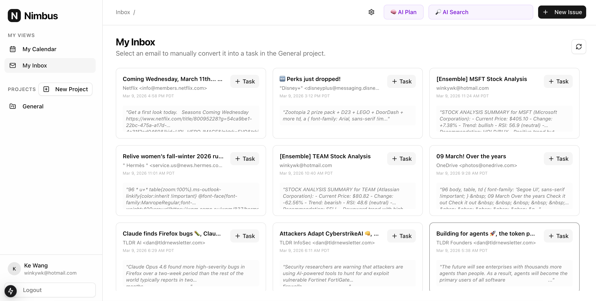

# Nimbus ☁️

**AI-Native Project Management System**

Nimbus is a modern, high-performance project management tool designed to replace legacy systems. It features a real-time Kanban board, local AI integration for planning, triage, and semantic search, and a dedicated client portal.

## 🚀 Features

*   **Local AI Intelligence (Ollama):**
    *   **🤖 AI Project Planner:** Turn natural language "brain dumps" into structured project tasks, **automatically scheduling them** with balanced due dates across the work week.
        *   **Project Selection:** Pick an existing project or create a new one before creating issues.
    *   **📅 AI Schedule:** Distributes open tasks that are unscheduled or past due across the work week (Monday-Friday), skipping weekends and resolving overdue backlogs.
    *   **✨ Smart Search:** A dedicated search dialog in the header that uses vector embeddings to find relevant issues by meaning. Results link directly to the issue detail view.
    *   **🧭 Similar Issues:** Detects likely duplicates when creating new issues.
    *   **🪄 AI Auto-Triage:** A "Wand" button in the Create Issue dialog that automatically suggests the issue priority using `gemma3`.
    *   **📝 AI Summary:** Generates a concise issue summary with next steps.
    *   **🔎 AI Filters:** Convert natural language into structured filters in List view.
    *   **🧾 Client Updates:** Drafts weekly client updates per project.
    *   **🔗 Dependency Detection:** Suggests issue dependencies from project context.
    *   **Unified AI Buttons:** Consistent AI button styling across the app.
    *   **Automatic Embedding:** Every issue is automatically vectorized on creation/update using `nomic-embed-text`.
*   **Interactive Views:**
    *   **Dynamic Sprint Plan (My Calendar):** A user-centric timeline showing all tasks assigned to you across **all projects**. Features horizontal scrolling, auto-adjusting range, and toggles for "Show Weekends" and "Show Completed".
        
    *   **Kanban Board:** Project-specific drag-and-drop interface with optimistic UI updates.
        
    *   **List View:** Fast, high-density issue tracking with interactive column sorting (Priority, Status, Due Date, etc.) and overdue highlights.
        
    *   **Global Timezone Support:** 🌍 Seamlessly manage tasks across different timezones. Users can set their preferred timezone in settings, and all dates/times (due dates, calendar views, overdue logic) automatically adjust to display correctly in their local time, while being stored as UTC.
*   **Visual Management:**
    *   **Smart Indicators:** Automatically highlights tasks that are **Overdue (Red)**, **Unassigned (Blue)**, or **Unscheduled (Amber)**.
    *   **Assignee Avatars:** See who is working on what at a glance.
*   **SSO & Email Integration:** 🔐
    *   **Single Sign-On:** Login seamlessly with **Google** or **Outlook**.
    *   **Auto-Project Creation:** On first login, Nimbus automatically creates a **"General"** project for you.
    *   **Email-to-Task Mastery:**
        *   **Automation:** Toggle automatic task generation in your User Settings. The background worker polls for new unseen emails every 60 seconds and uses `gemma3` to extract structured tasks into your **General** project.
        *   **Manual Inbox:** Access your SSO inbox directly from the **sidebar (Inbox)** as a primary view and manually convert emails into tasks. Tasks are automatically created in your **General** project and **assigned to you**.


        *   **Smart Display:** Email subjects and sender names are decoded (RFC 2047 / Base64), HTML-only emails show clean plain-text snippets, and all dates are shown in **your configured timezone**.

    


*   **Real-time Collaboration:** Live updates via WebSockets ensure your team is always in sync.
*   **Issue Management:**
    *   **Detail View:** Comprehensive modal for editing issues with quick actions ("Do Today", "Complete") for overdue tasks.
    *   **Persistent Preferences:** Remembers UI settings like the "Show Completed" and "Show Weekends" toggles across sessions.
*   **Role-Based Access:** Distinct views for Admins, Members, and Clients.
*   **File Storage:** Secure attachment handling with MinIO (S3 compatible).

## 🛠️ Tech Stack

*   **Frontend:** Next.js 15 (Stable), Tailwind CSS, Shadcn/UI, React Query.
*   **Backend:** FastAPI (Python), SQLAlchemy (Async), Alembic.
*   **Database:** PostgreSQL with `pgvector`.
*   **Infrastructure:** Docker Compose, Redis, MinIO.
*   **AI:** Ollama (Local LLM Inference).

## 📦 Prerequisites

1.  **Docker & Docker Compose**
2.  **Node.js 18+ & npm**
3.  **Python 3.9+**
4.  **Ollama** (Running locally)
    *   `ollama pull gemma3`
    *   `ollama pull nomic-embed-text`

## 🏃‍♂️ Quick Start

### 1. Start Infrastructure
Run the database, Redis, and MinIO services:
```bash
docker compose up -d
```

### 2. Backend Setup
```bash
cd backend
python3 -m venv venv
source venv/bin/activate
pip install -r requirements.txt

# Run Migrations
alembic upgrade head

# Start API Server
uvicorn app.main:app --reload
```
API Documentation: `http://localhost:8000/docs`

Start the async worker for AI jobs (embeddings backfill, etc.):
```bash
python -m app.worker
```

If you prefer Docker for backend + worker:
```bash
docker compose up -d backend worker
docker compose exec backend alembic upgrade head
```

### 3. Frontend Setup
```bash
cd frontend
npm install
PORT=3100 npm run dev
```
App: `http://localhost:3100`
If port 3100 is in use, pick another port (e.g. `PORT=3101`).

## 🧠 AI Configuration
Ensure **Ollama** is running on your host machine at `http://localhost:11434` (default).
The backend connects to it via `http://host.docker.internal:11434` if running in Docker, or `localhost` if running locally.

To test AI features:
1.  **Planner:** Click "AI Plan" in the header and type your project thoughts.
2.  **Schedule:** Go to "Calendar" tab and click "AI Schedule" to organize your week.
3.  **Search:** Click "Smart Search..." and find issues by meaning.
4.  **Triage Labels (API):** `POST /api/v1/ai/triage` with `issue_id` to persist labels.
5.  **Similar Issues:** In Create Issue, use "Find Similar".
6.  **Summary:** In Issue Detail, click "Generate Summary".
7.  **AI Filters:** In List view, use the AI filter input.
8.  **Client Update:** In project header, click "Client Update".
9.  **Dependencies:** In Issue Detail, click "Detect Dependencies".

## 📚 Documentation

*   [Product Requirements (PRD)](docs/PRD.md)
*   [Implementation Plan](docs/IMPLEMENTATION_PLAN.md)
*   [API Specification](docs/API_SPEC.md)
*   [AI Architecture](docs/AI_ARCHITECTURE.md)
*   [UX Design](docs/UX_Design.md)
*   [Deployment Guide](docs/DEPLOYMENT.md)

##  License


This project is licensed under the MIT License - see the [LICENSE](LICENSE) file for details.
