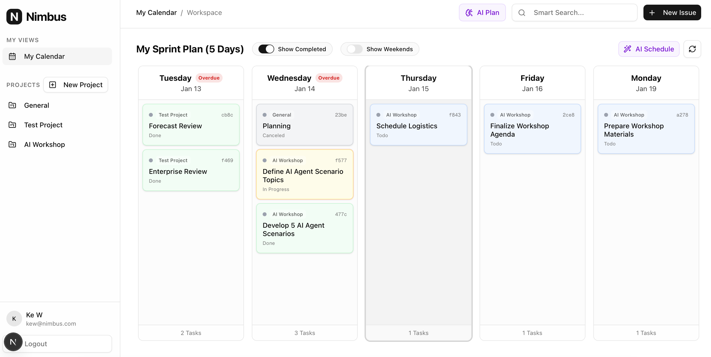
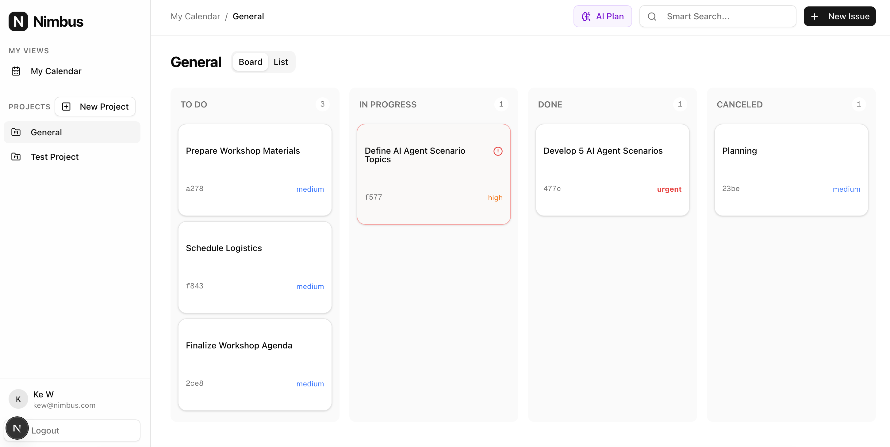
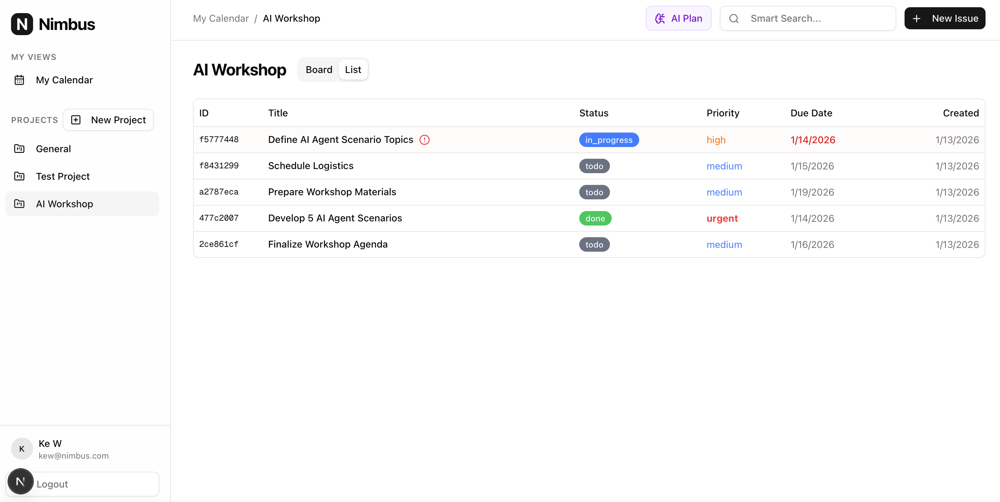
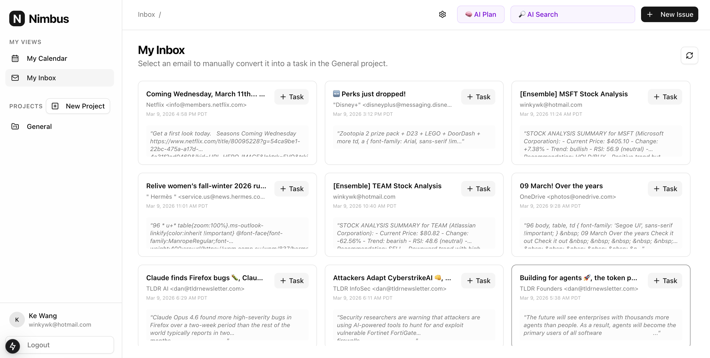

# Nimbus ☁️

**AI-Native Project Management System**

Nimbus is a modern, high-performance project management tool designed to replace legacy systems. It features a real-time Kanban board, local AI integration for planning, triage, and semantic search, and a dedicated client portal.

## 🚀 Features

*   **Local AI Intelligence (MLX + Apple Silicon):**
    *   **🤖 AI Project Planner:** Turn natural language "brain dumps" into structured project tasks, **automatically scheduling them** with balanced due dates across the work week.
        *   **Project Selection:** Pick an existing project or create a new one before creating issues.
    *   **📅 AI Schedule:** 
        *   **Input:** All open issues that are unscheduled, past due, or scheduled far in the future (> 7 days).
        *   **Output:** Updated `due_date` for each affected issue.
        *   **Capacity:** High-performance processing of up to **40 tasks** per batch, optimized for local inference.
        *   **Precision Intelligence:** Employs **Index Mapping** and **Day Number** strategies to ensure 100% scheduling accuracy even with smaller local models (1B/3B).
        *   **Logic:** Prioritizes unscheduled tasks first, followed by urgent items. Pulls all provided tasks into the next 5 days, strictly avoiding weekends and future-date hallucinations.
    *   **✨ Smart Search:** A dedicated search dialog in the header that uses vector embeddings to find relevant issues by meaning. Results link directly to the issue detail view.
    *   **🧭 Similar Issues:** Detects likely duplicates when creating new issues.
    *   **🪄 AI Auto-Triage:** A "Wand" button in the Create Issue dialog that automatically suggests the issue priority using Gemma 3 via MLX.
    *   **📝 AI Summary:** Generates a concise issue summary with next steps.
    *   **🔎 AI Filters:** Convert natural language into structured filters in List view.
    *   **🧾 Client Updates:** Drafts weekly client updates per project.
    *   **🔗 Dependency Detection:** Suggests issue dependencies from project context.
    *   **Unified AI Buttons:** Consistent AI button styling across the app.
    *   **Automatic Embedding:** Every issue is automatically vectorized on creation/update using `nomic-ai/nomic-embed-text-v1` via sentence-transformers.
*   **Interactive Views:**
    *   **Dynamic Sprint Plan (My Calendar):** A user-centric timeline showing all tasks assigned to you across **all projects**. Features horizontal scrolling, auto-adjusting range, and toggles for "Show Weekends" and "Show Completed".
        
    *   **Kanban Board:** Project-specific drag-and-drop interface with optimistic UI updates.
        
    *   **List View:** Fast, high-density issue tracking with interactive column sorting (Priority, Status, Due Date, etc.) and overdue highlights.
        
    *   **Global Timezone Support:** 🌍 Seamlessly manage tasks across different timezones. Users can set their preferred timezone in settings, and all dates/times (due dates, calendar views, overdue logic) automatically adjust to display correctly in their local time, while being stored as UTC.
*   **Visual Management:**
    *   **Smart Indicators:** Automatically highlights tasks that are **Overdue (Red)**, **Unassigned (Blue)**, or **Unscheduled (Amber)**.
    *   **Assignee Avatars:** See who is working on what at a glance.
*   **SSO & Email Integration:** 🔐
    *   **Single Sign-On:** Login seamlessly with **Google** or **Outlook**.
    *   **Auto-Project Creation:** On first login, Nimbus automatically creates a **"General"** project for you.
    *   **Email-to-Task Mastery:**
        *   **Automation:** Toggle automatic task generation in your User Settings. The background worker polls for new unseen emails every 60 seconds and uses Gemma 3 (via MLX) to extract structured tasks into your **General** project. The implementation uses atomic flagging (`BODY.PEEK`) to ensure emails are only marked as read after the task is successfully committed, preventing data loss during network or AI timeouts.
        *   **Smart Filtering:** The AI is trained to **ignore marketing boilerplate**, unsubscribe links, and newsletter footers. It focuses exclusively on extracting real, actionable tasks from the email body.
        *   **Multi-Task Extraction:** The AI can identify and extract **multiple distinct tasks** from a single email, creating a separate issue for each actionable item.
        *   **Resilient Parsing:** Features a robust multi-stage parser that handles common AI formatting errors, including stripping trailing comments, supporting single-quoted "JSON" via `ast.literal_eval`, and manual brace-matching recovery.
        *   **Resilient Fallback:** If AI extraction fails or returns no tasks, Nimbus automatically creates a "Raw" task from the email subject and body, ensuring no important information is ever lost.
        *   **De-duplication Safety:** Implements a two-layer check: first, identical titles within a single email are filtered; second, the system checks the database to prevent creating duplicate tasks that already exist for the user.
        *   **Manual Inbox:** Access your SSO inbox directly from the **sidebar (Inbox)**. To save bandwidth and improve performance, emails are only fetched when you click the **Refresh** button. Content is **persisted in memory**, so you can switch between views (e.g., Board or Calendar) and return to your inbox without losing your retrieved emails.
        *   **Bulk Task Creation:** Select one or multiple emails from your inbox using the visual checkboxes. Click the **+Task** button in the header to instantly convert all selected emails into structured tasks. This uses the same AI extraction engine as the automated poller but gives you full control over which items enter your workspace.


        *   **Smart Display:** Email subjects and sender names are automatically decoded from **RFC 2047 (MIME encoded-word)** format. This ensures that emojis and special characters (like smart quotes) in subject lines appear correctly as human-readable text.
        *   **Clean Snippets:** HTML-only emails are processed to show clean plain-text snippets, and all dates are displayed in your **configured timezone**.

        


*   **Real-time Collaboration:** Live updates via WebSockets ensure your team is always in sync.
*   **Issue Management:**
    *   **Detail View:** Comprehensive modal for editing issues with quick actions ("Do Today", "Complete") for overdue tasks.
    *   **Persistent Preferences:** Remembers UI settings like the "Show Completed" and "Show Weekends" toggles across sessions.
*   **Role-Based Access:** Distinct views for Admins, Members, and Clients.
*   **Audit Logs:** Built-in auditing engine keeping track of workspace events (Project/Task CRUD), email integrations, AI-driven scheduling, authentication, and file uploads. Captures entity titles and specific field-level changes for full accountability. ([View events list](docs/AUDITS.md))
*   **File Storage:** Secure attachment handling with MinIO (S3 compatible).

## 🛠️ Tech Stack

*   **Frontend:** Next.js 15 (Stable), Tailwind CSS, Shadcn/UI, React Query.
*   **Backend:** FastAPI (Python), SQLAlchemy (Async), Alembic.
*   **Database:** PostgreSQL with `pgvector`.
*   **Infrastructure:** Docker Compose, Redis, MinIO.
*   **AI:** MLX + `mlx-lm` (Gemma 3, Apple Silicon), `sentence-transformers` (embeddings).

## 📦 Prerequisites

1.  **Docker & Docker Compose**
2.  **Node.js 18+ & npm**
3.  **Python 3.10+** (Required for MLX & Gemma 3 support)
4.  **Apple Silicon Mac** (M1/M2/M3/M4) — required for MLX inference

## 🏃‍♂️ Quick Start

### 1. Start Infrastructure
Run the database, Redis, and MinIO services:
```bash
docker compose up -d
```

### 2. Backend Setup
```bash
cd backend
python3 -m venv venv
source venv/bin/activate
pip install -r requirements.txt

# Run Migrations
alembic upgrade head

# Start API Server (includes integrated Background Worker)
uvicorn app.main:app --reload --port 8100
```
API Documentation: `http://localhost:8100/docs`

> [!IMPORTANT]
> **Native macOS Requirement:** Because MLX is Apple Silicon exclusive (requiring direct Apple GPU access), the `backend` **must** run natively on your macOS host. Running it inside a Linux Docker container will cause MLX imports to fail. Accordingly, the Docker configuration is reserved strictly for database, Redis, and MinIO storage infrastructure.


### 3. Frontend Setup
```bash
cd frontend
npm install
PORT=3100 npm run dev
```
App: `http://localhost:3100`
If port 3100 is in use, pick another port (e.g. `PORT=3101`).

### 4. Interactive Port Diagnostics
To quickly verify that all Nimbus services are running on their correct ports and identify any port conflicts with other processes on your machine, simply run:
```bash
make ports
```
This prints a clean, real-time diagnostic dashboard directly in your terminal, showing which ports are `ACTIVE` (with their Process IDs and process names) or `FREE` (ready to use).

### 5. Stopping the Application
To stop all running frontend, backend services, and Docker infrastructure containers (db, redis, minio) in one command, run:
```bash
make stop
```


## 🧠 AI Configuration

### MLX + Local Inference
AI runs entirely on-device via **MLX** on Apple Silicon — no external server required. Models are downloaded automatically from Hugging Face on first use.

**Default models** (configurable via env vars):

| Env Var | Default | Purpose |
|:---|:---|:---|
| `MLX_CHAT_MODEL` | `mlx-community/Llama-3.2-1B-Instruct-4bit` | Planning, triage, summarization |
| `EMBEDDING_MODEL` | `nomic-ai/nomic-embed-text-v1` | Semantic search embeddings |
| `HF_TOKEN` | (optional) | Set this to your Hugging Face token to enable higher rate limits and faster downloads. |

To use a different model (e.g. a larger 4B or 8B model), set `MLX_CHAT_MODEL` in `backend/.env`.

> **Note:** MLX only runs natively on macOS with Apple Silicon. Inside the Linux Docker container, MLX is not available (as the C++ library is macOS exclusive). Consequently, standard MLX chat completions will fail with a descriptive ModuleNotFoundError if run inside the container. For full GPU performance and MLX chat features, you should run the backend natively on your host Apple Silicon Mac (using `make backend` or `make run`). Inference will still run locally via `sentence-transformers` on CPU inside the container for vector embeddings.

To test AI features:
1.  **Planner:** Click "AI Plan" in the header and type your project thoughts.
2.  **Schedule:** Go to "Calendar" tab and click "AI Schedule" to organize your week.
3.  **Search:** Click "Smart Search..." and find issues by meaning.
4.  **Triage Labels (API):** `POST /api/v1/ai/triage` with `issue_id` to persist labels.
5.  **Similar Issues:** In Create Issue, use "Find Similar".
6.  **Summary:** In Issue Detail, click "Generate Summary".
7.  **AI Filters:** In List view, use the AI filter input.
8.  **Client Update:** In project header, click "Client Update".
9.  **Dependencies:** In Issue Detail, click "Detect Dependencies".

## 🔌 MCP Server (Calendar & Tasks)
Nimbus features a built-in **Model Context Protocol (MCP)** server, enabling external AI assistants to directly manage your calendar and sprint plan. This integration allows AI tools to:

- **Sync Schedules**: Fetch all tasks with due dates to provide a comprehensive view of your upcoming week.
- **Manage Deadlines**: Update task timelines and schedule new items directly from your AI's chat interface.
- **Detailed Metadata**: Access full task descriptions, priority levels, and project assignments for better context.

### Connection Info
To connect an external tool, point your MCP client to the **SSE (Server-Sent Events)** endpoint:
`http://localhost:8100/mcp/sse`

### Available Tools
- `list_calendar_events`: Fetches a list of all scheduled tasks within a timeframe.
- `get_task_details`: Retrieves full metadata for a specific task ID.
- `schedule_task`: Updates the due date of an existing task.
- `create_calendar_task`: Adds a new task with an optional deadline and project name (defaults to 'General').
- `search_tasks`: Finds relevant tasks using natural language semantic search.
## 🔧 Troubleshooting & Utilities

### Python Compatibility
The backend is compatible with **Python 3.9+**. If you are running tests on Python 3.9, the `mcp` library (which requires 3.10) is automatically mocked to allow the core test suite to pass.

### GPU Out Of Memory (OOM) on macOS
Local AI completion uses the Apple Silicon GPU via MLX. If you hit a `std::runtime_error: [METAL] Command buffer execution failed: Insufficient Memory` error:
- **Cache Clearing:** The AI generation pipeline automatically clears the Metal memory cache (`mlx.core.metal.clear_cache()`) after each completion.
- **Worker Resilience:** The background worker is run inside an auto-restart loop in the `Makefile`. If it exits or crashes, it automatically restarts after 5 seconds to clear stale memory allocations and resume work.


## 📚 Documentation


*   [Product Requirements (PRD)](docs/PRD.md)
*   [Implementation Plan](docs/IMPLEMENTATION_PLAN.md)
*   [API Specification](docs/API_SPEC.md)
*   [AI Architecture](docs/AI_ARCHITECTURE.md)
*   [UX Design](docs/UX_Design.md)
*   [Deployment Guide](docs/DEPLOYMENT.md)
*   [Audit Logs Reference](docs/AUDITS.md)

##  License


This project is licensed under the MIT License - see the [LICENSE](LICENSE) file for details.
T.md)
*   [Audit Logs Reference](docs/AUDITS.md)

##  License


This project is licensed under the MIT License - see the [LICENSE](LICENSE) file for details.
